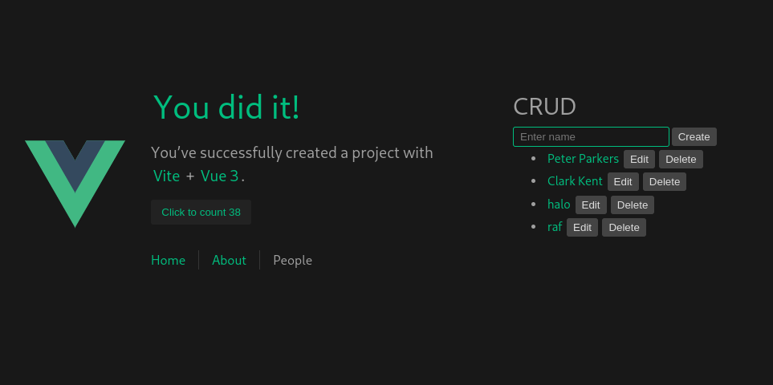

# node-vue

This template should help get you started developing with Vue 3 in Vite.

Running on Deno Runtime.

With some addition and activate the SSR funciton.
- Hono
- Sqlite
- Vue Router

Make sure you use Deno version 2.1.4 or later



### After clone this repo, you can hit install

```sh
$ deno install
```

### Compile and Hot-Reload for Development

```sh
$ deno task dev
```

### Compile and Minify for Production

```sh
$ deno task build
```

### Preview

```sh
$ deno task preview
```

### Run also the server so you can show the data from api after build process

```sh
$ deno task dev:api
```
