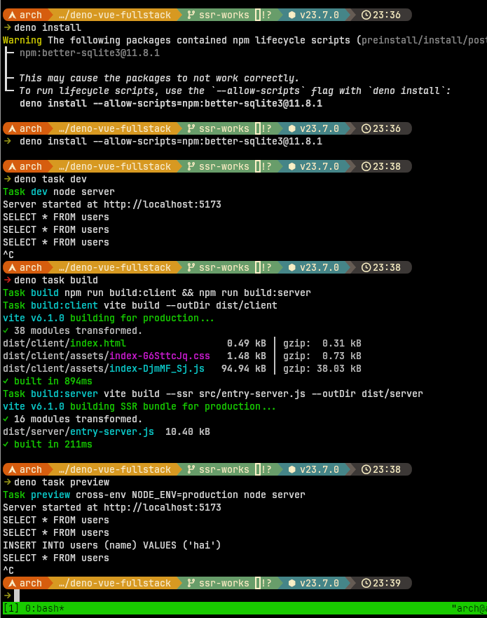
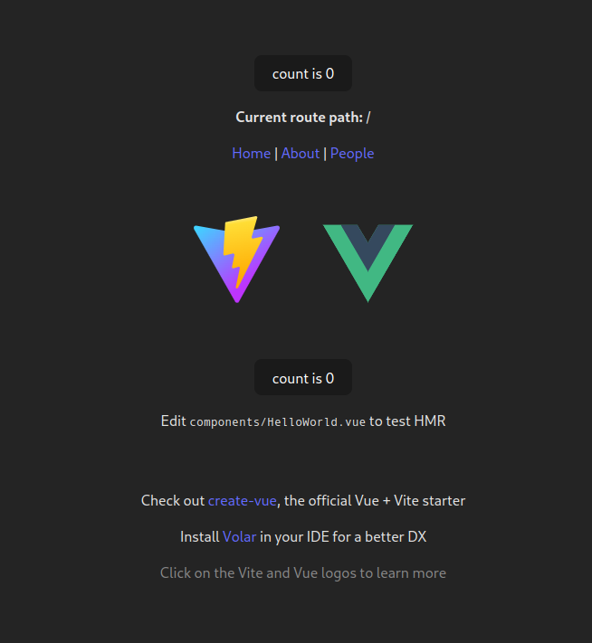
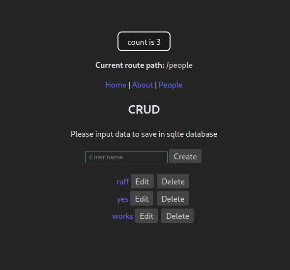

# CRUD app with Vue 3 + Vite + Vue Router + Express + Sqlite 

Actually the two previous branch is not serve well the SSR mode, so I create another vue app using `deno run -A npm:create-vite-extra` with SSR template of Vue.

This is crud app runs Vue + vite with SSR activate using Express and save and serve data using Sqlite database.

Also the router activate and serve using Vue Router so we can navigate to other pages.

```sh
$ deno install
$ deno task dev
$ deno task build
$ deno task preview
```

you will be prompted to install manually the better-sqlite3

```sh
$ deno install --allow-scripts=npm:better-sqlite3@11.8.1
```




